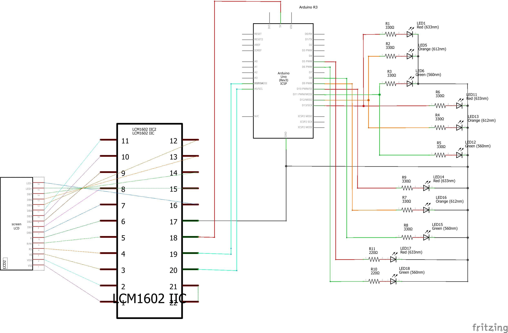

# Traffic Light Intersection

An Arduino based traffic light project for the class HTE501 (Electronics Circuits Laboratory) at the Physics Department of the Aristotle University of Thessaloniki.

Inside this repository readers can find:

- The fritzing schematic file `Traffic_light_intersection.fzz`
- The code for Arduino `traffic_lights.ino`

## Current Circuit Schematic

